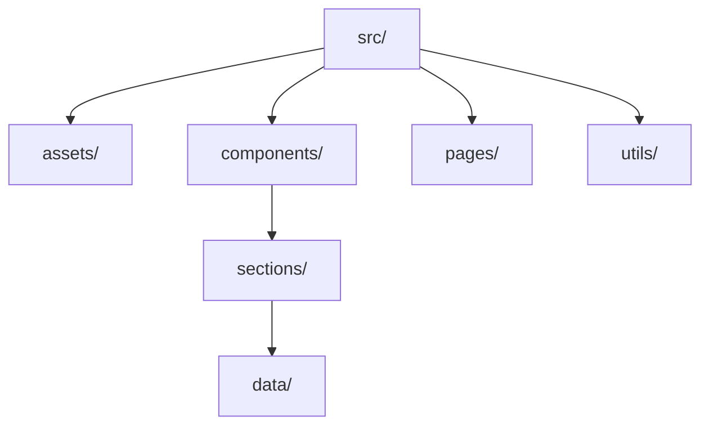
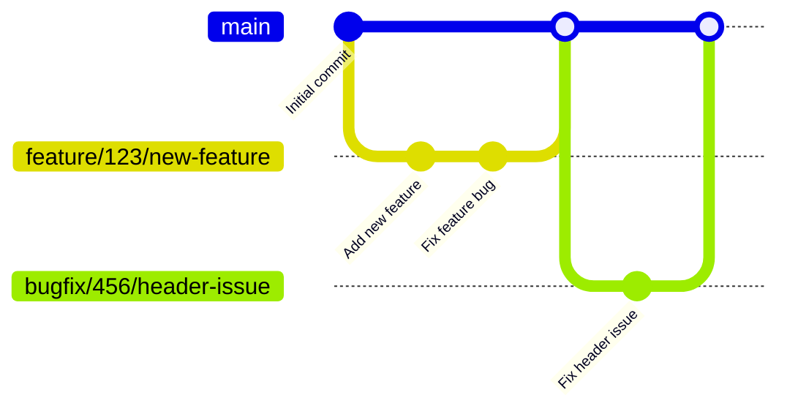
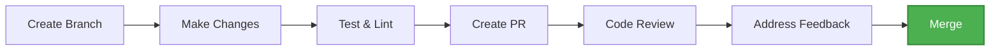
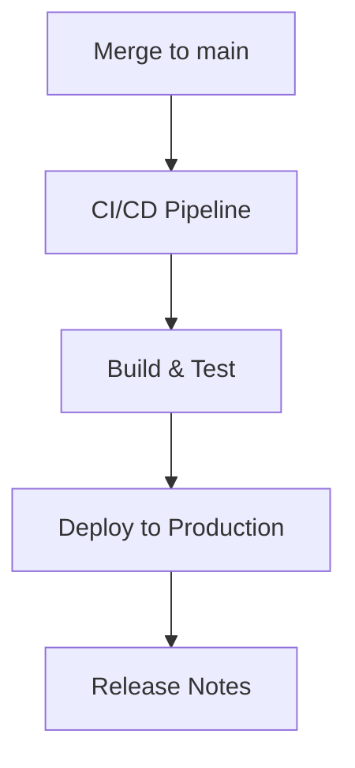

# <div align="center">🤝 Contributing to HawkHacks Landing Page</div>

<div align="center">
  <p>Thank you for your interest in contributing to the HawkHacks landing page!</p>
  <p>This document provides guidelines and instructions for contributing to this project.</p>
  
  
  
  
</div>

## 📋 Table of Contents

- [Development Environment Setup](#-development-environment-setup)
- [Project Structure](#-project-structure)
- [Development Workflow](#-development-workflow)
- [Coding Standards](#-coding-standards)
- [Pull Request Process](#-pull-request-process)
- [Deployment](#-deployment)

<hr/>

## 🛠️ Development Environment Setup

### Prerequisites

<table>
  <tr>
    <th>Software</th>
    <th>Version</th>
    <th>Installation Guide</th>
  </tr>
  <tr>
    <td>Node.js</td>
    <td>v18 or higher</td>
    <td><a href="https://nodejs.org/">Installation Guide</a></td>
  </tr>
  <tr>
    <td>pnpm</td>
    <td>Latest</td>
    <td><a href="https://pnpm.io/installation">Installation Guide</a></td>
  </tr>
  <tr>
    <td>Git</td>
    <td>Latest</td>
    <td><a href="https://git-scm.com/downloads">Installation Guide</a></td>
  </tr>
</table>

### Setting Up Your Local Environment

> Fork or Clone the Repository
  
```sh
# Fork the repository (if you don't have write access)
# Then clone your fork
git clone https://github.com/YOUR_USERNAME/HawkHacks-Landing.git
cd HawkHacks-Landing

# Alternatively, if you have write access
git clone https://github.com/KonferCA/HawkHacks-Landing.git
cd HawkHacks-Landing
```

> Install Dependencies
  
```sh
pnpm i
```

> Start Development Server
  
```sh
pnpm dev
```

> Build for Production (Optional)
  
```sh
pnpm build
pnpm preview  # To preview the production build
```

### Common Commands

| Command | Description |
|:-------:|:------------|
| `pnpm dev` | Start development server |
| `pnpm build` | Build for production |
| `pnpm preview` | Preview production build |
| `pnpm format` | Format code with Biome |
| `pnpm format:fix` | Apply new formatting|
| `pnpm lint` | Run Biome linter |
| `pnpm lint:fix` | Write safe fixes |

## 📁 Project Structure

<div align="center">



</div>

<table align="center">
  <tr>
    <th>Directory</th>
    <th>Purpose</th>
  </tr>
  <tr>
    <td><code>src/assets/</code></td>
    <td>Static assets like images, SVGs, etc.</td>
  </tr>
  <tr>
    <td><code>src/components/</code></td>
    <td>Reusable React components</td>
  </tr>
  <tr>
    <td><code>src/components/sections/</code></td>
    <td>Page section components</td>
  </tr>
  <tr>
    <td><code>src/components/sections/data/</code></td>
    <td>Data files for section components</td>
  </tr>
  <tr>
    <td><code>src/pages/</code></td>
    <td>Page components</td>
  </tr>
  <tr>
    <td><code>src/utils/</code></td>
    <td>Utility functions and services</td>
  </tr>
</table>

> [!TIP]
> Familiarize yourself with the project structure before making changes. This will help you understand where your contributions should go.

## 🔄 Development Workflow

### Branching Strategy

<div align="center">



</div>

| Branch Type | Pattern | Description |
|:------------|:--------|:------------|
| Main | `main` | Stable production code |
| Feature | `feat/issue-number/description` | For new features |
| Bug Fix | `bug/issue-number/description` | For bug fixes |
| Hot Fix | `hotfix/issue-number/description` | For urgent fixes to production |

### Creating a New Feature

**1. Create a new branch from `main`**
  
```sh
git checkout main
git pull origin main
git checkout -b feat/123/your-feature-name
```

**2. Make your changes and commit them**
  
```sh
git add .
git commit -m "feat: add new feature"
```
  
**Commit Message Format:**
  
```
type(scope): description
```
  
Types: `feat`, `fix`, `docs`, `style`, `refactor`, `test`

**3. Push your branch to GitHub**
  
```sh
git push origin feat/123/your-feature-name
```

**4. Create a Pull Request on GitHub**
  
Go to the repository on GitHub and create a new pull request from your branch to `main`.

> [!WARNING]
> Never commit directly to the `main` branch. Always create a new branch for your changes.

## 📝 Coding Standards

### General Guidelines

- Write clean, readable, and maintainable code
- Follow the existing code style and patterns
- Write descriptive commit messages
- Keep components small and focused on a single responsibility

### TypeScript/React

| ✅ Do | ❌ Don't |
|:------|:---------|
| Use TypeScript types | Use `any` type |
| Use functional components | Use class components |
| Use meaningful names | Use abbreviations |
| Follow file organization | Create new patterns |

### CSS/Styling

We use Tailwind CSS for styling. Follow these guidelines:

- Use the utility-first approach
- Create custom components for repeated UI patterns
- Extend Tailwind's theme for project-specific values

### Component Structure

<div class="code-example">

```tsx
// Imports organized logically
import React, { useState, useEffect } from 'react';
import ExternalLibrary from 'external-library';

// Local imports - use alias imports that have been setup
import { SomeComponent } from '@components';
import { useUtility } from '@utils';

// Props interface
interface ComponentProps {
   prop1: string;
   prop2?: number;
}

// Component implementation
export const Component: React.FC<ComponentProps> = ({ prop1, prop2 = 0 }) => {
   const [state, setState] = useState<string>('');
   
   useEffect(() => {
      // Side effects
   }, []);
   
   return (
       <div className="p-4">
         {/* TSX */}
       </div>
   );
};
```

</div>

> [!NOTE]
> Follow the existing patterns in the codebase. If you're unsure, ask for help.

## 🔍 Pull Request Process

<div align="center">



</div>

### PR Checklist

- [ ] Code follows the project's coding standards
- [ ] Changes have been tested locally
- [ ] Documentation has been updated (if necessary)
- [ ] PR has a descriptive title and description
- [ ] Related issues have been linked

### PR Template

```markdown
## Description
[Description of the changes]

## Related Issues
Fixes #123
Related to #456

## Type of Change
- [ ] Bug fix
- [ ] New feature
- [ ] Documentation update
- [ ] Code refactor
- [ ] Other (please describe):

## Screenshots (if applicable)

## Checklist
- [ ] My code follows the project's coding standards
- [ ] I have tested my changes locally
- [ ] I have updated the documentation accordingly
- [ ] My changes generate no new warnings
```

> [!TIP]
> Link any related issues in your PR description using keywords like "Fixes #123" or "Relates to #456".

## 🚀 Deployment

<div align="center">



</div>

Deployment is handled automatically through our CI/CD pipeline when changes are merged to the `main` branch.

| Environment | URL | Branch | Auto-deploy |
|:------------|:----|:-------|:------------|
| Production | [hawkhacks.ca](https://hawkhacks.ca) | `main` | ✅ |

> [!NOTE]
> You don't need to worry about deployment as it's managed by the project maintainers.

### Useful Resources

- [React Documentation](https://reactjs.org/docs/getting-started.html)
- [TypeScript Documentation](https://www.typescriptlang.org/docs/)
- [Tailwind CSS Documentation](https://tailwindcss.com/docs)
- [pnpm Documentation](https://pnpm.io/motivation)

---

<div align="center">

Thank you for contributing to HawkHacks Landing Page! 🎉

</div>
